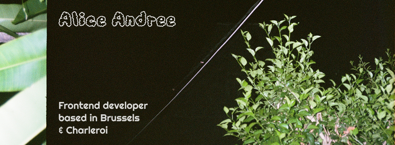

<!-- ### Hi there 👋

**AliceAndree/AliceAndree** is a ✨ _special_ ✨ repository because its `README.md` (this file) appears on your GitHub profile.

Here are some ideas to get you started:

- 🔭 I’m currently working on ...
- 🌱 I’m currently learning ...
- 👯 I’m looking to collaborate on ...
- 🤔 I’m looking for help with ...
- 💬 Ask me about ...
- 📫 How to reach me: ...
- 😄 Pronouns: ...
- ⚡ Fun fact: ...
-->

# Hi, I'm Alice Andrée (she / her) 👋🏻 ✨

 

# About Me:
🔭 I’m currently looking for a new job opportunity 🌱 I’m currently updating my knowledge in web development with The Odin Project 💬 Ask me about why I think coding is a creative process ⚡ Fun fact: I used to work as a Backend Developer and switched carreer for 8 years.

# Tech Stack:
     
